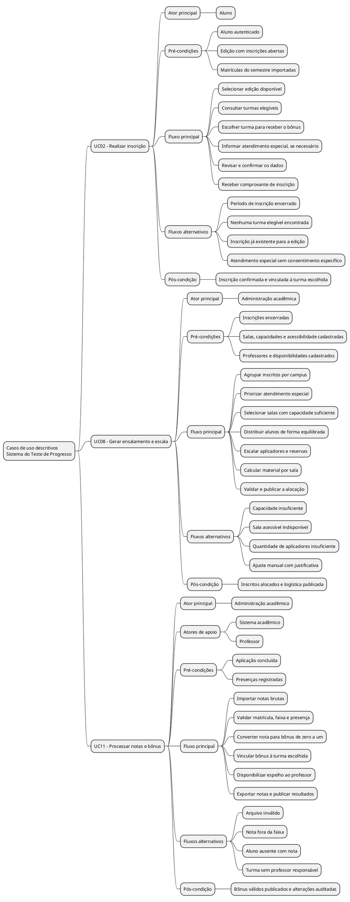

# Casos de Uso — Sistema do Teste de Progresso

## Objetivo

Este documento descreve como os usuários interagem com o Sistema do Teste de
Progresso. A modelagem foi derivada do brainstorm, da pesquisa e do protótipo
de baixa fidelidade, priorizando as três principais necessidades identificadas:
inscrição com escolha da disciplina, organização da aplicação presencial e
lançamento do bônus.

## Atores

| Ator | Responsabilidade no sistema |
|---|---|
| **Aluno** | Inscrever-se, escolher a turma que receberá o bônus, consultar local, resultado e os próprios dados. |
| **Professor** | Consultar sua escala de aplicação e o espelho de alunos e bônus das disciplinas sob sua responsabilidade. |
| **Coordenação de curso** | Consultar indicadores de adesão e desempenho do próprio curso. |
| **Administração acadêmica** | Configurar edições, importar dados, organizar a aplicação, processar notas e emitir relatórios. |
| **Sistema acadêmico** | Fornecer dados de alunos, turmas e matrículas e receber a exportação das notas. |
| **Serviço de e-mail** | Enviar confirmações de inscrição e comunicações sobre o local de prova. |

Aluno, professor, coordenação e administração são especializações do ator
**Usuário institucional** e acessam o sistema por credencial institucional.

## Catálogo de casos de uso

| ID | Caso de uso | Ator principal | Resultado esperado |
|---|---|---|---|
| UC01 | Autenticar usuário | Usuário institucional | Usuário identificado e direcionado ao painel do seu perfil. |
| UC02 | Realizar inscrição | Aluno | Inscrição confirmada e vinculada a uma turma elegível. |
| UC03 | Alterar ou cancelar inscrição | Aluno | Inscrição atualizada ou cancelada dentro do prazo. |
| UC04 | Consultar inscrição, local e resultado | Aluno | Dados da participação exibidos conforme a etapa da edição. |
| UC05 | Gerenciar edição | Administração acadêmica | Edição, período, campi, cursos e regra do bônus configurados. |
| UC06 | Importar dados acadêmicos | Administração acadêmica | Alunos, turmas, matrículas e professores validados e disponíveis. |
| UC07 | Gerenciar campi, salas e disponibilidades | Administração acadêmica | Recursos físicos e humanos preparados para o ensalamento. |
| UC08 | Gerar ensalamento e escala | Administração acadêmica | Alunos, salas, aplicadores e materiais distribuídos. |
| UC09 | Ajustar alocação com justificativa | Administração acadêmica | Exceção logística registrada na trilha de auditoria. |
| UC10 | Registrar presença | Administração acadêmica | Presença ou ausência registrada para cada inscrito. |
| UC11 | Processar notas e bônus | Administração acadêmica | Bônus válidos vinculados às turmas e prontos para exportação. |
| UC12 | Consultar espelho de notas | Professor | Relação de alunos e bônus da disciplina exibida. |
| UC13 | Consultar escala de aplicação | Professor | Local, horário, função e documentos da aplicação exibidos. |
| UC14 | Consultar relatórios e indicadores | Coordenação e administração | Dados consolidados de adesão, ocupação e desempenho exibidos. |
| UC15 | Consultar e exportar os próprios dados | Aluno | Histórico pessoal apresentado e exportado em CSV ou PDF. |

## Casos de uso descritivos

### UC02 — Realizar inscrição

| Campo | Descrição |
|---|---|
| **Objetivo** | Inscrever o aluno em uma edição aberta e definir a turma em que o bônus será lançado. |
| **Ator principal** | Aluno. |
| **Atores de apoio** | Sistema acadêmico e serviço de e-mail. |
| **Gatilho** | O aluno seleciona a ação **Fazer inscrição** em uma edição disponível. |
| **Pré-condições** | Aluno autenticado; edição com inscrições abertas; dados de matrícula do semestre importados; aluno ainda não inscrito na edição. |
| **Pós-condição de sucesso** | Inscrição confirmada, vinculada à turma escolhida e com comprovante emitido. |
| **Pós-condição mínima** | Nenhuma inscrição incompleta é mantida como confirmada. |

#### Fluxo principal

1. O aluno acessa a edição disponível.
2. O sistema confirma que o período de inscrição está aberto e que não existe
   outra inscrição ativa do aluno na mesma edição.
3. O sistema consulta as matrículas vigentes do aluno.
4. O sistema apresenta apenas as turmas elegíveis do semestre atual, com
   disciplina, código da turma e professor responsável.
5. O aluno escolhe uma turma para receber o bônus.
6. O aluno informa, opcionalmente, se necessita de atendimento especial.
7. Quando houver atendimento especial, o sistema apresenta o aviso específico
   sobre o tratamento do dado sensível e solicita consentimento destacado.
8. O sistema apresenta a revisão da edição, do campus e da turma escolhida.
9. O aluno confirma os dados.
10. O sistema valida novamente o prazo e as regras da inscrição, registra a
    inscrição e gera seu número de comprovante.
11. O sistema exibe o comprovante e solicita ao serviço de e-mail o envio da
    confirmação.

#### Fluxos alternativos e de exceção

| ID | Condição | Resposta do sistema |
|---|---|---|
| A1 | O período de inscrição está fechado. | Impede a confirmação e informa as datas de abertura e fechamento. |
| A2 | Já existe inscrição ativa do aluno na edição. | Direciona o aluno para **Minha inscrição**, onde poderá alterá-la ou cancelá-la dentro do prazo. |
| A3 | Nenhuma turma elegível foi encontrada. | Não permite prosseguir e orienta o aluno a procurar a secretaria acadêmica. |
| A4 | A turma deixou de fazer parte da matrícula antes da confirmação. | Atualiza a lista de turmas e solicita uma nova escolha. |
| A5 | O aluno solicita atendimento especial, mas não registra o consentimento específico. | Mantém a inscrição sem confirmação e destaca o campo pendente. |
| A6 | O prazo encerra durante o preenchimento. | Não confirma a inscrição e informa que o período foi encerrado. |
| A7 | O serviço de e-mail está indisponível. | Mantém a inscrição confirmada, exibe o comprovante no sistema e registra a falha de envio para nova tentativa. |

#### Regras de negócio

- **RN01:** cada aluno pode possuir somente uma inscrição ativa por edição.
- **RN02:** a inscrição deve apontar para exatamente uma turma da matrícula
  vigente do aluno.
- **RN03:** a inscrição só pode ser criada, alterada ou cancelada durante o
  período definido para a edição.
- **RN04:** o pedido de atendimento especial é opcional e seu dado sensível tem
  acesso restrito.
- **RN05:** o consentimento é específico para a solicitação de atendimento
  especial, não para os demais dados acadêmicos necessários à inscrição.
- **RN06:** a turma escolhida determina a disciplina e o professor que receberão
  o espelho do bônus.

**Rastreabilidade:** BS05 a BS09; RF-09 a RF-14; telas 02, 03 e 04 do protótipo.

### UC08 — Gerar ensalamento e escala

| Campo | Descrição |
|---|---|
| **Objetivo** | Distribuir os inscritos entre salas e preparar aplicadores, materiais e documentos da aplicação. |
| **Ator principal** | Administração acadêmica. |
| **Gatilho** | A administração seleciona **Gerar ensalamento** em uma edição. |
| **Pré-condições** | Inscrições encerradas; campi e salas cadastrados; capacidade de prova e acessibilidade informadas; professores e disponibilidades cadastrados. |
| **Pós-condição de sucesso** | Todos os inscritos ficam alocados; cada sala ocupada possui aplicador; materiais e documentos são calculados; local fica disponível para publicação. |
| **Pós-condição mínima** | Uma proposta inválida não pode ser publicada. |

#### Fluxo principal

1. A administração seleciona a edição e os campi que serão processados.
2. O sistema agrupa as inscrições confirmadas por campus.
3. O sistema separa as inscrições com atendimento especial deferido.
4. O sistema verifica se há capacidade de prova suficiente em cada campus e
   reserva primeiro as salas acessíveis necessárias.
5. O sistema seleciona as demais salas conforme capacidade e margem de
   segurança configurada.
6. O sistema distribui os alunos de forma equilibrada sem ultrapassar a
   capacidade de prova de cada sala.
7. O sistema escala ao menos um professor disponível para cada sala ocupada e
   define os professores reservas.
8. O sistema calcula cadernos, cartões-resposta, listas e envelopes por sala,
   acrescidos da margem de reserva.
9. O sistema valida as restrições rígidas e apresenta o resumo da proposta.
10. A administração revisa a ocupação, a escala e os alertas.
11. O sistema gera mapa de sala, lista de presença e identificação de porta.
12. A administração aprova e publica o local da prova para os alunos.

#### Fluxos alternativos e de exceção

| ID | Condição | Resposta do sistema |
|---|---|---|
| A1 | A capacidade do campus é insuficiente. | Bloqueia a publicação, informa quantas vagas faltam e sugere cadastrar ou liberar outra sala. |
| A2 | Não há sala acessível suficiente. | Bloqueia a alocação dos alunos afetados e solicita intervenção administrativa. |
| A3 | Faltam professores aplicadores. | Identifica as salas sem aplicador e impede a publicação da escala. |
| A4 | Um professor aparece em duas salas no mesmo horário. | Marca o conflito e exige substituição. |
| A5 | A administração deseja realocar um aluno ou professor. | Executa o UC09, exigindo justificativa e registrando autor, data, valor anterior e novo valor. |
| A6 | Uma alteração manual viola capacidade, campus ou acessibilidade. | Rejeita a alteração e apresenta a regra violada. |

#### Regras de negócio

- **RN07:** deve ser usada a capacidade de prova da sala, não a capacidade
  nominal.
- **RN08:** o aluno só pode ser alocado em sala do seu campus acadêmico.
- **RN09:** atendimento especial deferido exige ambiente compatível.
- **RN10:** toda sala ocupada deve possuir ao menos um aplicador.
- **RN11:** um professor não pode atuar em duas salas no mesmo horário.
- **RN12:** nenhum inscrito confirmado pode permanecer sem sala na proposta
  publicada.
- **RN13:** ajustes manuais exigem justificativa e trilha de auditoria.

**Rastreabilidade:** BS10 a BS23; RF-15 a RF-23; tela 08 do protótipo.

### UC11 — Processar notas e bônus

| Campo | Descrição |
|---|---|
| **Objetivo** | Importar o resultado do teste, converter a nota para bônus e direcioná-lo à turma escolhida pelo aluno. |
| **Ator principal** | Administração acadêmica. |
| **Atores de apoio** | Sistema acadêmico e professor. |
| **Gatilho** | A administração seleciona **Importar notas** após a aplicação. |
| **Pré-condições** | Aplicação concluída; presenças registradas; inscrições vinculadas às turmas; regra de conversão configurada. |
| **Pós-condição de sucesso** | Bônus válidos calculados, espelhos disponibilizados, arquivo de exportação gerado e resultados publicados. |
| **Pós-condição mínima** | Registros inconsistentes permanecem bloqueados e não são exportados. |

#### Fluxo principal

1. A administração seleciona a edição e envia o arquivo de notas brutas.
2. O sistema valida formato, colunas obrigatórias, matrícula e duplicidade.
3. O sistema relaciona cada linha à inscrição e ao registro de presença.
4. O sistema valida a faixa da nota bruta.
5. O sistema converte a nota válida para a faixa de bônus de 0 a 1 definida na
   edição.
6. O sistema bloqueia o bônus dos alunos registrados como ausentes.
7. O sistema vincula cada bônus à turma escolhida na inscrição e identifica seu
   professor responsável.
8. O sistema apresenta totais processados, bloqueios e inconsistências.
9. A administração corrige ou exclui os registros inválidos e confirma o lote.
10. O sistema disponibiliza o espelho para cada professor, contendo somente as
    turmas sob sua responsabilidade.
11. O sistema gera o arquivo de exportação para o sistema acadêmico.
12. A administração publica os resultados para os alunos.
13. O sistema registra na auditoria a importação, as correções e a publicação.

#### Fluxos alternativos e de exceção

| ID | Condição | Resposta do sistema |
|---|---|---|
| A1 | Arquivo em formato inválido ou sem colunas obrigatórias. | Rejeita o lote inteiro e apresenta os erros de estrutura. |
| A2 | Matrícula não encontrada ou duplicada. | Mantém a linha bloqueada e permite exportar um relatório de inconsistências. |
| A3 | Nota fora da faixa configurada. | Não calcula o bônus e exige correção. |
| A4 | Aluno ausente possui nota no arquivo. | Mantém o bônus bloqueado mesmo que a nota seja válida. |
| A5 | A turma escolhida não possui professor responsável. | Bloqueia a exportação desse registro até a correção do vínculo acadêmico. |
| A6 | Uma nota já publicada precisa ser alterada. | Exige justificativa e registra valor anterior, valor novo, autor e data na trilha de auditoria. |
| A7 | O sistema acadêmico não aceita a importação. | Preserva o lote aprovado, registra a falha e permite gerar novo arquivo após a correção. |

#### Regras de negócio

- **RN14:** o bônus final deve permanecer entre 0 e 1.
- **RN15:** aluno ausente não recebe bônus.
- **RN16:** o bônus deve ser direcionado à turma escolhida na inscrição.
- **RN17:** o professor visualiza somente alunos das turmas sob sua
  responsabilidade.
- **RN18:** toda criação ou alteração de nota deve ser auditável e preservar o
  valor anterior.
- **RN19:** somente registros válidos e confirmados podem ser exportados.

**Rastreabilidade:** BS24 a BS30 e BS36; RF-24 a RF-28 e RF-33; telas 05 e 09 do protótipo.

## Visão hierárquica dos casos descritivos

O mapa mental utiliza a mesma estrutura com asteriscos do exemplo contido no
arquivo `mp.puml`.

## Diagrama de casos de uso

```plantuml
@startuml Diagrama_Casos_de_Uso_Teste_de_Progresso
left to right direction
skinparam monochrome true
skinparam shadowing false
skinparam packageStyle rectangle
skinparam actorStyle awesome

actor "Usuário institucional" as Usuario
actor Aluno
actor Professor
actor "Coordenação de curso" as Coordenacao
actor "Administração acadêmica" as Administracao
actor "Sistema acadêmico" as SistemaAcademico
actor "Serviço de e-mail" as Email

Aluno -|> Usuario
Professor -|> Usuario
Coordenacao -|> Usuario
Administracao -|> Usuario

rectangle "Sistema do Teste de Progresso" {
  package "Acesso" {
    usecase "UC01\nAutenticar usuário" as UC01
  }

  package "Inscrição e autoatendimento" {
    usecase "UC02\nRealizar inscrição" as UC02
    usecase "Consultar turmas\nelegíveis" as UC02a
    usecase "Escolher turma de\ndestino do bônus" as UC02b
    usecase "Emitir comprovante" as UC02c
    usecase "Solicitar atendimento\nespecial" as UC02d
    usecase "UC03\nAlterar ou cancelar\ninscrição" as UC03
    usecase "UC04\nConsultar inscrição,\nlocal e resultado" as UC04
    usecase "UC15\nConsultar e exportar\nos próprios dados" as UC15
  }

  package "Configuração e logística" {
    usecase "UC05\nGerenciar edição" as UC05
    usecase "UC06\nImportar dados\nacadêmicos" as UC06
    usecase "UC07\nGerenciar campi, salas\ne disponibilidades" as UC07
    usecase "UC08\nGerar ensalamento\ne escala" as UC08
    usecase "Validar capacidade,\ncampus e acessibilidade" as UC08a
    usecase "Escalar aplicadores\ne reservas" as UC08b
    usecase "Calcular materiais\npor sala" as UC08c
    usecase "Gerar documentos\nda aplicação" as UC08d
    usecase "UC09\nAjustar alocação\ncom justificativa" as UC09
  }

  package "Aplicação, notas e gestão" {
    usecase "UC10\nRegistrar presença" as UC10
    usecase "UC11\nProcessar notas\ne bônus" as UC11
    usecase "Importar e validar\nnotas brutas" as UC11a
    usecase "Converter nota\npara bônus" as UC11b
    usecase "Exportar notas" as UC11c
    usecase "UC12\nConsultar espelho\nde notas" as UC12
    usecase "UC13\nConsultar escala\nde aplicação" as UC13
    usecase "UC14\nConsultar relatórios\ne indicadores" as UC14
  }
}

Usuario --> UC01

Aluno --> UC02
Aluno --> UC03
Aluno --> UC04
Aluno --> UC15

Professor --> UC12
Professor --> UC13

Coordenacao --> UC14

Administracao --> UC05
Administracao --> UC06
Administracao --> UC07
Administracao --> UC08
Administracao --> UC09
Administracao --> UC10
Administracao --> UC11
Administracao --> UC14

SistemaAcademico --> UC06
SistemaAcademico --> UC11c
Email --> UC02c

UC02 .> UC02a : <<include>>
UC02 .> UC02b : <<include>>
UC02 .> UC02c : <<include>>
UC02d .> UC02 : <<extend>>

UC08 .> UC08a : <<include>>
UC08 .> UC08b : <<include>>
UC08 .> UC08c : <<include>>
UC08 .> UC08d : <<include>>
UC09 .> UC08 : <<extend>>

UC11 .> UC11a : <<include>>
UC11 .> UC11b : <<include>>
UC11 .> UC11c : <<include>>
@enduml
```

### Leitura dos relacionamentos

- `<<include>>` representa uma etapa obrigatória do caso de uso principal. Por
  exemplo, realizar uma inscrição sempre inclui consultar as turmas elegíveis,
  escolher a turma e emitir o comprovante.
- `<<extend>>` representa um comportamento condicional. A solicitação de
  atendimento especial só ocorre quando necessária, e o ajuste manual só ocorre
  quando a proposta automática exige intervenção.
- O sistema acadêmico e o serviço de e-mail estão fora da fronteira do produto
  e participam apenas como sistemas de apoio.

## Versionamento

| Data | Versão | Descrição | Autor(es) |
|---|---:|---|---|
| 02/09/2026 | 1.0 | Criação dos casos de uso descritivos e do diagrama de casos de uso | Equipe do projeto |
