# Protótipo de Baixa Fidelidade — Teste de Progresso

## Introdução

O protótipo de baixa fidelidade representa, de forma simples e sem preocupação visual, as telas do Sistema do Teste de Progresso e o caminho que cada perfil percorre dentro dele. Seu objetivo é validar com o stakeholder (Pró-Reitoria Acadêmica) o fluxo das funcionalidades, os dados exibidos em cada tela e as regras de negócio levantadas no brainstorm, na pesquisa e nos casos de uso, antes da construção do protótipo de alta fidelidade.

## Metodologia

As telas foram derivadas dos casos de uso UC01 a UC15 e dos requisitos RF-01 a RF-34. Os wireframes foram desenhados com <b>PlantUML Salt</b>, que gera esboços em preto e branco a partir de texto e é renderizado diretamente na documentação pelo plugin PlantUML do MkDocs. Todos os nomes, matrículas e notas apresentados são fictícios, conforme o RNF-07.

## Mapa de navegação

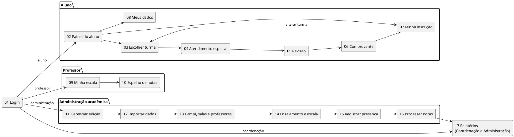

## Versão 2.0

### Tela 01 — Login institucional

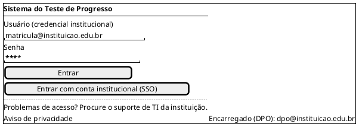

- **UC01 · RF-01, RF-02.** Após autenticar, o usuário é direcionado ao painel do seu perfil (aluno, professor, coordenação ou administração).
- Não há "esqueci minha senha": a credencial é da instituição, então a recuperação é feita pelo suporte de TI.
- O aviso de privacidade e o contato do encarregado ficam visíveis desde o login (LGPD, art. 41).

### Tela 02 — Painel do aluno

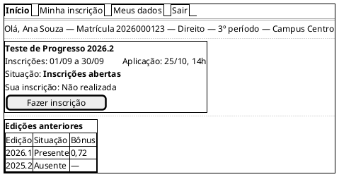

- **UC04 · RF-09, RF-22.** Mostra a edição vigente, o prazo e o status da inscrição do aluno.
- Se já houver inscrição ativa, o botão muda para **Ver minha inscrição** (UC02, fluxo A2).
- Fora do período, o botão fica desabilitado e as datas são exibidas (UC02, A1).

### Tela 03 — Inscrição: escolher a turma do bônus

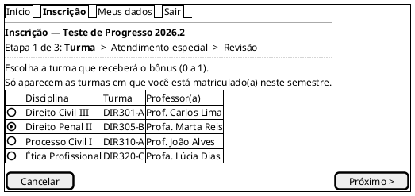

- **UC02 · RF-10 · RN01, RN02, RN06.** Só é possível escolher uma turma, e ela precisa vir da matrícula vigente.
- A turma define a disciplina e o professor que receberão o espelho do bônus.
- Se não houver turma elegível, a lista é substituída pela orientação de procurar a secretaria (UC02, A3).

### Tela 04 — Inscrição: atendimento especial

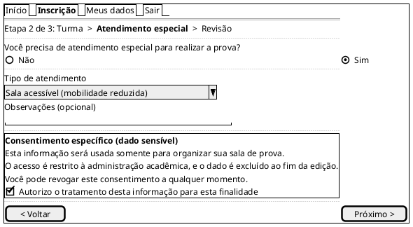

- **UC02 (extensão "Solicitar atendimento especial") · RF-11 · RN04, RN05.**
- O campo é opcional. Quem responde **Não** não vê o bloco de consentimento.
- Se marcar **Sim** sem dar o consentimento, a inscrição não avança e o campo fica destacado (UC02, A5).

### Tela 05 — Inscrição: revisão e confirmação

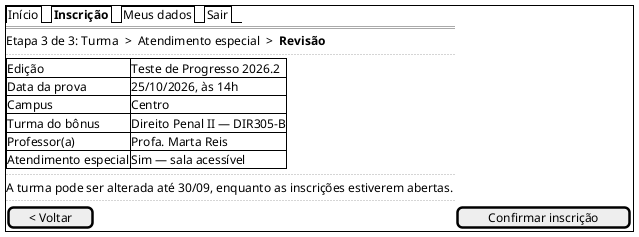

- **UC02, passos 8 a 10.** No momento da confirmação, o sistema valida de novo o prazo e as regras.
- Se o prazo acabar durante o preenchimento, a inscrição não é confirmada (UC02, A6).

### Tela 06 — Comprovante de inscrição

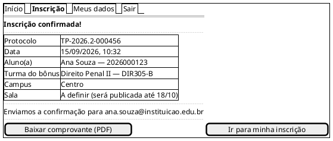

- **UC02, passo 11 · RF-12, RF-14.**
- Se o e-mail falhar, o comprovante continua disponível aqui e o envio é tentado de novo (UC02, A7).

### Tela 07 — Minha inscrição (local e resultado)

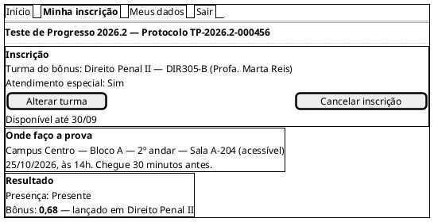

- **UC03, UC04 · RF-13, RF-22.** Os blocos aparecem conforme a etapa da edição:
    - "Onde faço a prova" só aparece depois que o ensalamento é publicado.
    - "Resultado" só aparece depois que as notas são publicadas.
- **Alterar** e **Cancelar** só ficam habilitados durante o período de inscrição (RN03).
- Pedido de realocação de sala: o aluno pode solicitar revisão da alocação automática (LGPD, art. 20).

### Tela 08 — Meus dados

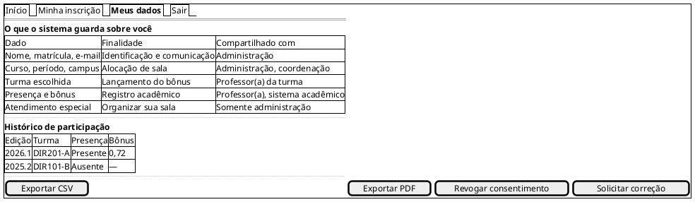

- **UC15 · RF-32 · LGPD, art. 18.** Garante acesso, portabilidade, revogação do consentimento (apenas para o atendimento especial) e pedido de correção.
- Os pedidos de correção são encaminhados ao encarregado (DPO) da instituição.

### Tela 09 — Professor: minha escala de aplicação

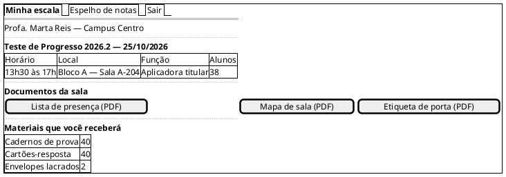

- **UC13 · RF-19, RF-20, RF-21.** O professor apenas consulta a escala; quem monta é a administração (Tela 14).
- As quantidades de material já incluem a margem de reserva.

### Tela 10 — Professor: espelho de notas

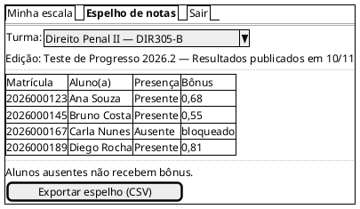

- **UC12 · RF-26, RF-28 · RN15, RN17.** A tela é somente leitura: o professor não importa notas nem registra presença.
- Aparecem apenas as turmas sob responsabilidade do professor.

### Tela 11 — Administração: gerenciar edição

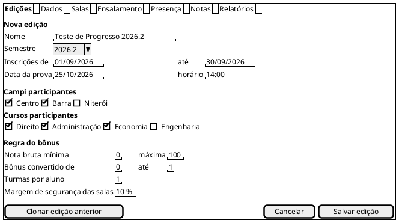

- **UC05 · RF-05, RF-06, RF-07, RF-08.** A faixa do bônus fica sempre entre 0 e 1 (RN14).
- Equilibrar a ocupação ou minimizar salas é uma configuração da edição, não uma regra fixa (Pesquisa, 2.7.2).

### Tela 12 — Administração: importar dados acadêmicos

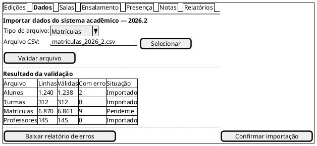

- **UC06 · RF-03, RF-04.** A integração com o sistema acadêmico é feita por arquivo, não em tempo real.
- Linhas com erro ficam de fora até serem corrigidas.

### Tela 13 — Administração: campi, salas e professores

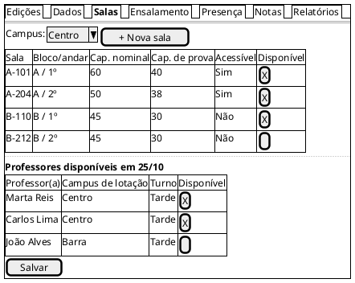

- **UC07 · RF-15, RF-16 · RN07.** O ensalamento usa sempre a capacidade de prova, não a capacidade nominal.

### Tela 14 — Administração: ensalamento e escala

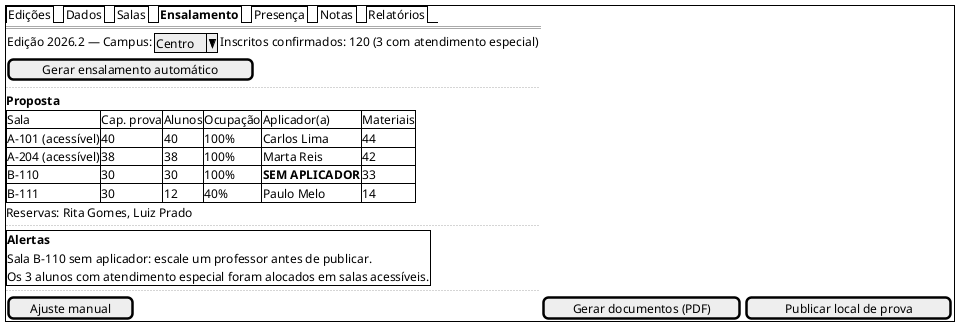

Ajuste manual (abre ao clicar em **Ajuste manual**):

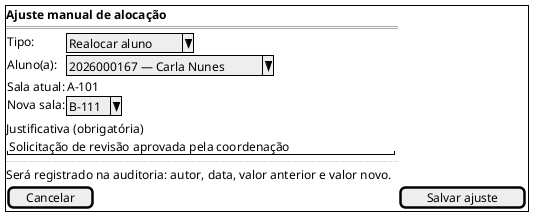

- **UC08, UC09 · RF-17 a RF-21, RF-23 · RN07 a RN13.**
- **Publicar** fica bloqueado enquanto houver uma violação de regra obrigatória: sala sem aplicador, falta de capacidade, falta de sala acessível ou inscrito sem sala (UC08, A1 a A4).
- Um ajuste manual que viole capacidade, campus ou acessibilidade é rejeitado, e a tela mostra a regra violada (UC08, A6).

### Tela 15 — Administração: registrar presença

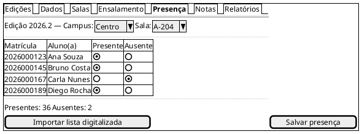

- **UC10 · RF-24.** A presença registrada aqui define quem pode receber o bônus (RN15).

### Tela 16 — Administração: processar notas e bônus

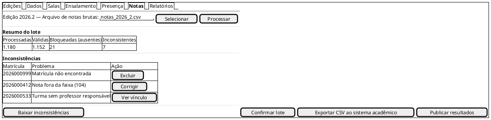

- **UC11 · RF-25, RF-27, RF-28, RF-33 · RN14 a RN19.** Só registros válidos e confirmados são exportados.
- Um arquivo com estrutura inválida é rejeitado por inteiro (UC11, A1).
- Alterar uma nota já publicada exige justificativa e vai para a trilha de auditoria (UC11, A6).

### Tela 17 — Relatórios e indicadores

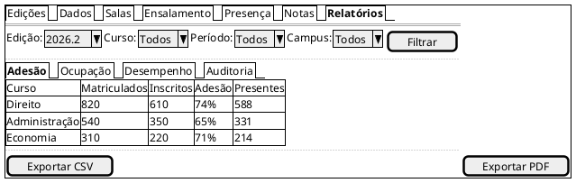

- **UC14 · RF-29 a RF-31, RF-33, RF-34 · RN17.** A coordenação vê a mesma tela, mas restrita ao próprio curso e sem as abas administrativas.
- Os dados de desempenho são agregados e, sempre que possível, anonimizados.

## Versão 1.0

A primeira versão, em texto, tinha cinco telas: Login, Inscrição do Aluno, Painel do Professor, Ensalamento e Relatórios. A versão 2.0 fez estas mudanças:

- Cobre todos os casos de uso, de UC01 a UC15.
- Retira do professor a importação de notas e o registro de presença, que passam para a administração, como definido no UC10 e no UC11.
- Troca o "esqueci minha senha" pelo acesso institucional.
- Inclui atendimento especial com consentimento, comprovante e "Meus dados", para atender à LGPD.

## Rastreabilidade

| Tela | Caso de uso | Requisitos |
|---|---|---|
| 01 | UC01 | RF-01, RF-02 · BS01, BS02 |
| 02 | UC04 | RF-09, RF-22 |
| 03 | UC02 | RF-10 · BS06, BS07 |
| 04 | UC02 (extensão) | RF-11 |
| 05 | UC02 | RF-09 · BS05 |
| 06 | UC02 | RF-12, RF-14 · BS09 |
| 07 | UC03, UC04 | RF-13, RF-22 · BS08, BS23 |
| 08 | UC15 | RF-32 |
| 09 | UC13 | RF-19, RF-20, RF-21 |
| 10 | UC12 | RF-26, RF-28 · BS29 |
| 11 | UC05 | RF-05 a RF-08 · BS03, BS04 |
| 12 | UC06 | RF-03, RF-04 |
| 13 | UC07 | RF-15, RF-16 · BS10, BS11, BS17 |
| 14 | UC08, UC09 | RF-17 a RF-21, RF-23 · BS12 a BS22 |
| 15 | UC10 | RF-24 · BS24 |
| 16 | UC11 | RF-25, RF-27, RF-28, RF-33 · BS25 a BS28, BS30 |
| 17 | UC14 | RF-29 a RF-31, RF-34 · BS31 a BS33 |

## Conclusão

O protótipo de baixa fidelidade permitiu visualizar a jornada completa de cada perfil, do login à publicação do bônus, e confirmar que os casos de uso e as regras de negócio têm uma tela correspondente. Ele também deixou explícitas as premissas a validar com a Pró-Reitoria, como a diferença entre capacidade nominal e capacidade de prova e a escolha entre equilibrar a ocupação ou minimizar salas. Esse material servirá de base para o protótipo de alta fidelidade e para os diagramas de sequência.

## Referências

> PlantUML. Salt (wireframes). Disponível em: https://plantuml.com/salt

> Documentos do projeto: Pesquisa, Brainstorm e Casos de Uso do Teste de Progresso.

## Versionamento

| Data | Versão | Descrição | Autor(es) |
| -- | -- | -- | -- |
| — | 1.0 | Protótipo textual com 5 telas | Equipe do projeto |
| 26/09/2026 | 2.0 | Wireframes em PlantUML Salt com 17 telas, mapa de navegação e rastreabilidade | Equipe do projeto |
